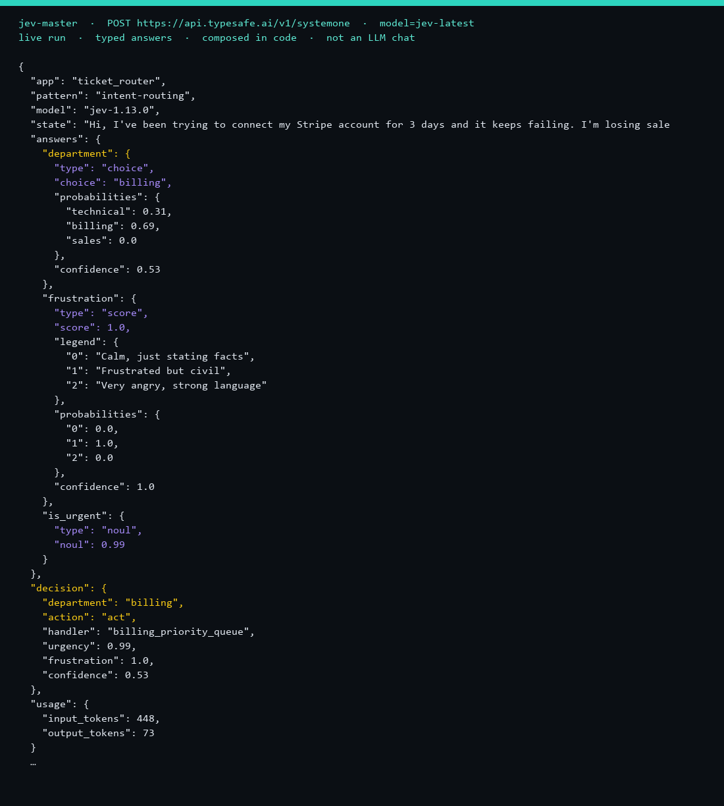

<p align="center">
  
</p>

<p align="center">
  <strong><a href="README.md">English</a></strong>
  &nbsp;·&nbsp;
  <strong><a href="README.ko.md">한국어</a></strong>
</p>

<p align="center">
  
  
  
  
  
</p>

# jev-master

**State in. Typed answers out. Your code decides.**

[TypeSafe Jev](https://docs.typesafe.ai/concepts/system-one) is a decision model, not a chatbot. You send a **state** and named **questions**. You get Choice / Score / Noul probabilities. This repo:

1. **Runs** seven compose apps on a live `POST /v1/systemone` client.
2. **Indexes** 382 public projects **by category** ([`docs/ECOSYSTEM.md`](docs/ECOSYSTEM.md)). Links only — nothing is cloned.

The screenshot is a real `jev-1.13.0` call on `examples/stripe-ticket.txt` → `act` / `billing_priority_queue`. JSON: [`docs/assets/live-run.json`](docs/assets/live-run.json).

Not affiliated with TypeSafe. [Djev](https://djev.dev) (images) is Maisa, not TypeSafe.

---

## Browse by category

### A. Apps in this repo (you run these)

| Category | Command | Use it when |
| --- | --- | --- |
| **Routing** | `python -m jev_master ticket --state examples/stripe-ticket.txt` | Which queue / department? |
| **Confidence gate** | `python -m jev_master gate --state examples/voice-command.txt` | Act, ask a human, or escalate? |
| **Scoring** | `python -m jev_master pitch --state examples/pitch.txt` | Weighted 0–1 score, not one label |
| **Canned bot** | `python -m jev_master bot --state examples/stripe-ticket.txt` | Fixed `reply` / `escalate` / `block` — not an LLM chat |
| **Tool harness** | `python -m jev_master harness --state examples/rm-step.json` | Agent wants a tool: `execute` / `confirm` / `reject` |
| **Merge gate** | `python -m jev_master code --state examples/risky.diff` | Diff: `merge` / `comment` / `block` |
| **Playground UI** | `python -m jev_master browser` | Inspect bars in the browser on **:8765** |
| **Field catalog** | `python -m jev_master catalog --kind vision` | List citations; `--kind` picks a row below |

Folders: [`ticket_router`](apps/ticket_router) · [`confidence_gate`](apps/confidence_gate) · [`pitch_score`](apps/pitch_score) · [`jev_bot`](apps/jev_bot) · [`jev_harness`](apps/jev_harness) · [`jev_code`](apps/jev_code) · [`jev_browser`](apps/jev_browser)

Standalone packages: [jev-bot](https://github.com/kevin9327/jev-bot) · [jev-harness](https://github.com/kevin9327/jev-harness) · [jev-code](https://github.com/kevin9327/jev-code)

### B. Public field (382 citations, not cloned)

Jump the full table: [`docs/ECOSYSTEM.md`](docs/ECOSYSTEM.md). Or print one kind:

| Kind | Count | What you will find | Command | Full table |
| --- | ---: | --- | --- | --- |
| `official` | 12 | TypeSafe docs, SDKs, gateways | `--kind official` | [Official](docs/ECOSYSTEM.md#official) |
| `sdk` | 40 | Python, JS, Go, Rust, Java, … clients | `--kind sdk` | [SDKs](docs/ECOSYSTEM.md#sdks-and-clients) |
| `agent` | 73 | MCP, tool gates, routers, compaction | `--kind agent` | [Agents](docs/ECOSYSTEM.md#agents-gates-mcp) |
| `browser` | 32 | Browser / desktop / phone computer-use | `--kind browser` | [Browser](docs/ECOSYSTEM.md#browser-and-computer-use) |
| `vision` | 19 | Images: OCR→Jev, Djev, local VL | `--kind vision` | [Vision](docs/ECOSYSTEM.md#vision-images-and-local-eyes) |
| `app` | 71 | Products (triage, SQL, trading, …) | `--kind app` | [Apps](docs/ECOSYSTEM.md#applications) |
| `game` | 31 | Doom, Mario, snake, drone, … | `--kind game` | [Games](docs/ECOSYSTEM.md#games-and-simulations) |
| `research` | 58 | Local / open Jev replicas | `--kind research` | [Replicas](docs/ECOSYSTEM.md#open-replicas-and-evals) |
| `list` | 16 | Other awesome-jev directories | `--kind list` | [Lists](docs/ECOSYSTEM.md#other-directories) |
| `x` | 30 | Source threads on X | `--kind x` | [X](docs/ECOSYSTEM.md#x-threads) |

```bash
python -m jev_master catalog
python -m jev_master catalog --kind vision
python -m jev_master catalog --json
```

---

## Start here

1. Python 3.10+ and a TypeSafe key from [console.typesafe.ai/settings/keys](https://console.typesafe.ai/settings/keys).
2. Clone, test, set the key **in this shell** (never commit it). `.env` / `jevkey.txt` are gitignored.
3. Run `ticket` once and read `answers` (Jev) vs `decision` (this repo).

```bash
git clone https://github.com/kevin9327/jev-master
cd jev-master
python -m pip install -e ".[dev]"
python -m pytest
```

PowerShell: `$env:TYPESAFE_API_KEY = '…'` · bash: `export` that same name, then:

```bash
python -m jev_master ticket --state examples/stripe-ticket.txt
```

## What Jev returns

One HTTP call can mix all three. Code composes the app decision.

| Primitive | Ask | You get |
| --- | --- | --- |
| **Choice** | Which option? | `choice`, `probabilities`, `confidence` |
| **Score** | Where on this rubric? | `score`, `legend`, `probabilities`, `confidence` |
| **Noul** | Is this true? | `noul` in `[0, 1]` |

```
state + questions  →  POST https://api.typesafe.ai/v1/systemone
                   →  compose_*() here  →  route / gate / score
```

Change a coefficient in Python when policy changes. Do not rewrite a prompt.

Live ticket sample (`examples/stripe-ticket.txt`):

```json
{
  "answers": {
    "department": { "choice": "billing", "confidence": 0.53 },
    "frustration": { "score": 1.0 },
    "is_urgent": { "noul": 0.99 }
  },
  "decision": {
    "department": "billing",
    "action": "act",
    "handler": "billing_priority_queue"
  }
}
```

Tests inject that answer shape without the network.

## Playground UI

```bash
python -m jev_master browser
```

Open [http://127.0.0.1:8765](http://127.0.0.1:8765). The key stays on the server process.

## Images (own category: `vision`)

**TypeSafe Jev is text-only.** Staff on X: [wait a while](https://x.com/dotpem/status/2101335033609138382).

| Method | What the model sees | Examples |
| --- | --- | --- |
| OCR / caption | Text | [typesafe-computer-use](https://github.com/awlevin/typesafe-computer-use) · [nothotdog](https://github.com/anishsrinivasan/nothotdog) |
| CV → JSON | Scene numbers | [jev-drone](https://github.com/RomanSlack/jev-drone) |
| Swap the model | Pixels | [djev-dev](https://github.com/Davipar/djev-dev) · [jev_local](https://github.com/Argos1111/jev_local) |
| Pixel questions | A text grid (drawing) | [typesafe-image-diffusion](https://github.com/Wizhill05/typesafe-image-diffusion) |

Djev is invite-only. A TypeSafe key will 401 there. Full list: `python -m jev_master catalog --kind vision`

## Secrets

Runtime-only. Do not paste keys into README, tests, issues, or screenshots.

## Troubleshooting

| Symptom | Check |
| --- | --- |
| `TYPESAFE_API_KEY is not set` | Set it in **this** shell |
| HTTP 401 | TypeSafe key → `api.typesafe.ai`. Djev needs `djev_invite_…` |
| HTTP 403 | Account on the TypeSafe waitlist |
| `pip install -e .` fails on Windows | Python 3.10+; tests: `PYTHONPATH=src` then `python -m pytest` |
| Empty browser | Start `browser` first, then port 8765 |
| Bad `--kind` | Use a kind from the table in **B** |

## License

MIT. See [LICENSE](LICENSE).
